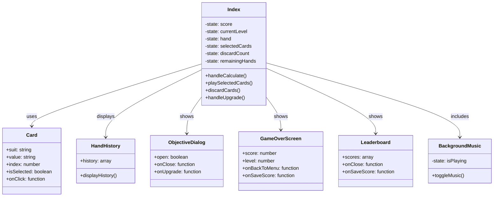

# Royal Fortune - Jeu de Poker Revisité

Royal Fortune est un jeu de cartes stratégique inspiré du poker, où vous devez créer les meilleures combinaisons possibles pour marquer des points et progresser à travers différents niveaux.

## Diagramme UML des Composants



## Règles du Jeu Détaillées

### Objectif
Le but est d'atteindre les objectifs de points à chaque niveau en créant les meilleures combinaisons de cartes possibles.

### Déroulement
1. **Début de partie**
   - Vous commencez avec 8 cartes en main
   - 5 mains à jouer par niveau
   - 3 défausses disponibles

2. **Actions possibles**
   - Sélectionner des cartes pour former une combinaison
   - Défausser des cartes non désirées (maximum 3 fois)
   - Jouer une combinaison

3. **Système de Points**
   - **Quinte Flush** : (Somme des cartes × 10)
   - **Carré** : (Valeur du carré × 4 × 8)
   - **Full** : (Valeur du brelan × 3 + Valeur de la paire × 2) × 5
   - **Flush** : (Somme des cartes × 6)
   - **Quinte** : (Somme des cartes × 4)
   - **Brelan** : (Valeur du brelan × 3 × 3)
   - **Double Paire** : (Somme des paires × 2)
   - **Paire** : (Valeur de la paire × 2 × 2)

4. **Système de Combo**
   - Les combinaisons identiques consécutives forment un combo
   - Chaque combo augmente les points de 50%

### Niveaux et Progression

1. **Structure des niveaux**
   - 10 niveaux de difficulté croissante
   - Objectifs de points progressifs
   - Multiplicateurs débloquables à chaque niveau

2. **Objectifs par niveau**
   - Niveau 1 : 150 points
   - Niveau 2 : 450 points
   - Niveau 3 : 1000 points
   - Niveau 4 : 2000 points
   - Niveau 5 : 3500 points
   - Niveau 6 : 5500 points
   - Niveau 7 : 8000 points
   - Niveau 8 : 11000 points
   - Niveau 9 : 15000 points
   - Niveau 10 : 20000 points

## Fonctionnalités

### Interface de Jeu
- Main de 8 cartes avec sélection interactive
- Animations fluides des cartes
- Affichage des points en temps réel
- Historique des mains jouées
- Système de combo visuel
- Musique de fond d'ambiance

### Système de Progression
- Multiplicateurs débloquables
- Tableau des scores
- Sauvegarde des meilleurs scores
- Mode Terminal pour les puristes

### Personnalisation
- Contrôle de la musique de fond
- Pseudo personnalisable
- Interface responsive

### Mode Terminal
Une version simplifiée jouable dans le terminal pour les puristes :
1. Assurez-vous d'avoir Node.js installé
2. Naviguez jusqu'au dossier du projet
3. Exécutez : `node src/terminal/royalFortune.js`

## Astuces Stratégiques

1. **Gestion des Défausses**
   - Gardez au moins une défausse pour les situations critiques
   - Privilégiez les cartes hautes lors des défausses

2. **Optimisation des Points**
   - Visez les combos pour multiplier vos points
   - Concentrez-vous sur les combinaisons fortes en début de niveau

3. **Progression**
   - Choisissez les multiplicateurs en fonction de votre style de jeu
   - Planifiez vos coups sur plusieurs mains

## Installation et Développement

```bash
# Installation des dépendances
npm install

# Lancement en mode développement
npm run dev

# Construction pour la production
npm run build
```

Amusez-vous bien !
